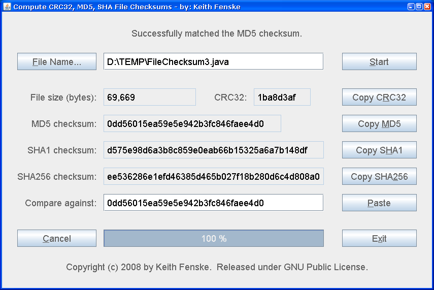

### File Checksum (Java)

by: Keith Fenske, https://kwfenske.github.io/

FileChecksum is a Java 1.4 application to compute common checksums for files:
CRC32, MD5, SHA1, and optional SHA256 or SHA512. Checksums are small
hexadecimal "signatures" for testing whether or not files have been copied
correctly, such as over a network. One person sends a file along with the
checksum computed on the original computer. A second person calculates a
similar checksum for the received file, and if the two checksums agree, then
the received file is assumed to be correct. Many web sites provide MD5
signatures for their downloads; use this program to verify files that you
download.

Download the ZIP file here: https://kwfenske.github.io/file-checksum-java.zip

Released under the terms and conditions of the Apache License (version 2.0 or
later) and/or the GNU General Public License (GPL, version 2 or later).

